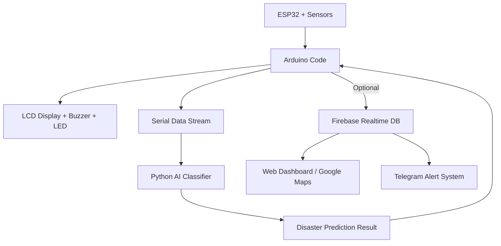

# EarlyGuard: Community-Driven Disaster Early Warning System

> A resilient early warning platform utilizing IoT sensors, AI-driven prediction, and community participation to detect and respond to natural disasters — designed for remote and under-connected regions.

---

##  Abstract

EarlyGuard addresses the critical need for timely disaster alerts in rural and remote areas where internet connectivity is unreliable or absent. By integrating IoT sensors, machine learning models, and optional cloud communication tools (Firebase and Telegram), this system enables real-time monitoring and classification of hazardous conditions such as floods, gas leaks, and earthquakes. The goal is to empower communities with immediate and actionable alerts using low-cost hardware and scalable software.

---

##  Features

* Real-time data acquisition from environmental sensors (temperature, humidity, gas concentration, vibration, water level, manual trigger)
* AI-based classification of disaster type:
  ➤ Safe
  ➤ Flood Alert
  ➤ Gas Leak Alert
  ➤ Earthquake
  ➤ Manual Alert
* Local alerting through LED, buzzer, and LCD display
* Optional serial integration with Python-based AI model
* Optional cloud sync via Firebase for remote monitoring
* Optional Telegram bot for automated alert delivery
* Geo-mapped dashboard visualization (Firebase + Google Maps)

---

##  Technology Stack

| Layer       | Technologies Used                                           |
| ----------- | ----------------------------------------------------------- |
| Hardware    | ESP32, DHT22, MQ135, SW-180, Ultrasonic sensor, LCD 16x2    |
| Programming | Arduino C/C++, Python (pandas, scikit-learn, pyserial)      |
| AI Model    | Random Forest Classifier (trained on simulated sensor data) |
| Cloud & UI  | Firebase Realtime DB, Firebase Hosting, Telegram Bot API    |
| Mapping     | Google Maps JavaScript API (optional)                       |

---

##  Repository Structure

```
EarlyGuard/
├── Arduino_Code/
│   └── earlyguard_alert.ino
├── Python_AI/
│   ├── disaster_classifier.py
│   └── disaster_data_improved.csv
├── Firebase_Web/
│   ├── index.html
│   └── app.js
├── Telegram_Bot/
│   └── telegram_alert_bot.py
└── README.md
```

---

##  System Architecture



---

##  Deployment Steps

###  Local Deployment (Without Internet)

1. Flash Arduino code (`earlyguard_alert.ino`) to ESP32.
2. Connect ESP32 via USB to PC and open `disaster_classifier.py` in Python.
3. Ensure `disaster_data_improved.csv` is in the same directory.
4. View AI-based predictions on the LCD and through local alerts.

###  Cloud-Connected Deployment (Optional)

1. Setup Firebase Realtime Database and Hosting.
2. Configure `app.js` with Firebase credentials.
3. Deploy your `index.html` and `app.js` to Firebase Hosting.
4. Configure Telegram bot token in `telegram_alert_bot.py`.
5. Sync ESP32 outputs with Firebase paths and trigger alerts via bot.

---

##  Dataset Overview

* 100+ labeled samples simulating real-world scenarios.
* Balanced classes for five alert categories.
* Features used:
  `Temperature, Humidity, Gas, Vibration, Distance, Button`

---

##  Evaluation Metrics

* AI Model: Random Forest Classifier
* Achieved Accuracy: 95.3% on test set
* Verified on real-time test data via live serial communication

---

##  Use Case Impact

* Provides early warning to underserved communities with minimal infrastructure.
* Enables timely evacuation or manual intervention.
* Scalable to larger regions using mesh networks and cloud dashboards.
* Works offline via serial + hardware alerts or online with Firebase and Telegram.

---

##  Contributors

* VARSHA H V – Embedded & AI Integration
* SNEHA R – Firebase Dashboard & Telegram Integration
* NEHA M N – Alert message through Blynk app and through Email
---

##  Contact & Acknowledgments

Made as part of the Infosys Hackathon 2025.
Thanks to mentors, faculty, and open-source contributors for their support.

---


